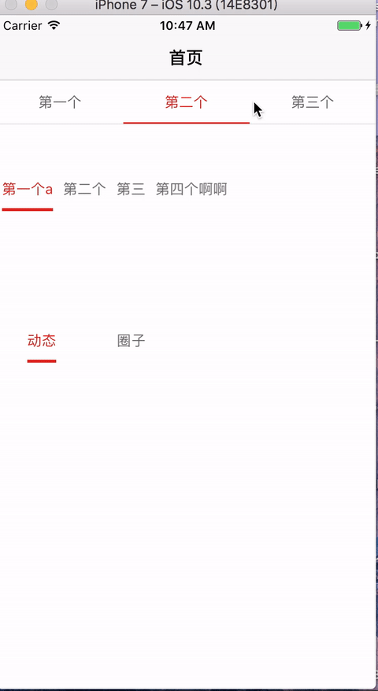

# JDragonTypeButtonView
iOS  SliderBtn 封装

![badge-pod] ![badge-languages] ![badge-platforms] ![badge-mit]


# 使用效果


### user pod

```

pod 'JDragonTypeButtonView','~> 0.0.3'


```

##基本使用

```

@interface ViewController ()<JDragonTypeButtonActionDelegate>

@end
@implementation ViewController

- (void)viewDidLoad {
[super viewDidLoad];
self.title = @"首页";
// Do any additional setup after loading the view, typically from a nib.

JDragonTypeButtonView  *typeBtnView = [[JDragonTypeButtonView  alloc]initWithFrame:CGRectMake(0, 64, [UIScreen mainScreen].bounds.size.width, 44)];
[typeBtnView setTypeButtonTitles:@[@"第一个",@"第二个",@"第三个"] withDownLableHeight:2 andDeleagte:self];
[typeBtnView setTypeButtonNormalColor:RGBCOLOR(0x656565) andSelectColor:RGBCOLOR(0xde2418)];
typeBtnView.backgroundColor = [UIColor whiteColor];
[self.view addSubview:typeBtnView];
}
//实现代理
-(void)didClickTypeButtonAction:(UIButton*)button withIndex:(NSInteger)index
{
NSLog(@"现在点击的是%ld个",index);
}


```

##详细请看demo


[badge-platforms]: https://img.shields.io/badge/platforms-iOS-lightgrey.svg
[badge-pod]: https://img.shields.io/cocoapods/v/JDragonTypeButtonView.svg?label=version
[badge-languages]: https://img.shields.io/badge/languages-ObjC-orange.svg
[badge-mit]: https://img.shields.io/badge/license-MIT-blue.svg
